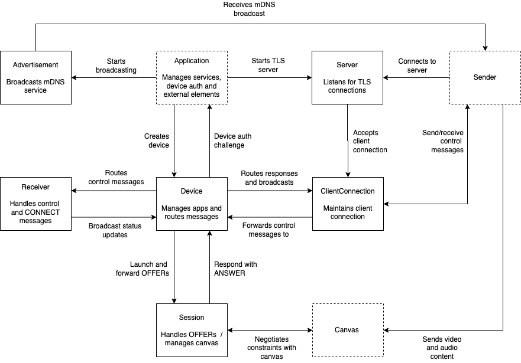
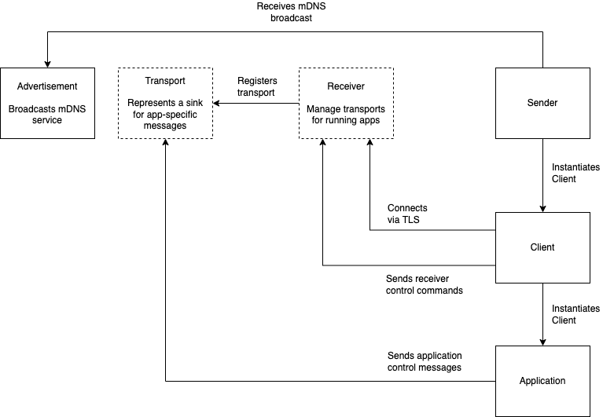

# GoCast

This project is intended to offer a complete implementation of the [Google Cast](https://en.wikipedia.org/wiki/Google_Cast) protocol, written in Go, with custom Sender and Receiver apps using GLFW for the frontend.

GoCast currently supports streams using VP8, with H.264 support on the roadmap. Audio is currently not supported.

## Design

The following architecture diagram summarises the overall design of the GoCast Receiver app, and how it accommodates the requirements of the Google Cast protocol:

In terms of actual code, these concepts are implemented as Go structs.

The Sender architecture is somewhat simpler:

The key difference here is that the sender app does not need to maintain multiple connections, and is designed only to launch a single app.

## Usage

### Receiver App

The `receiver` app will start a Google Cast receiver, which can then be cast to from compatible senders.

To run the receiver in your local dev environment:

    go run cmd/receiver/*.go --cert-manifest=<path>

Or to build an executable in `./bin/receiver`:

    go build -o ./bin/receiver ./cmd/receiver

### Sender App

To run the sender in your local dev environment:

    go run cmd/sender/*.go

Or to build an executable in `./bin/sender`:

    go build -o ./bin/sender ./cmd/sender

### Discovery App

The `discovery` app allows you to locate Google Cast devices on your network, using mDNS.

To run the discovery app in your local dev environment:

    go run cmd/discovery/*.go

Or to build an executable in `./bin/discovery`:

    go build -o ./bin/discovery ./cmd/discovery

## Cert Manifests

Before running the Receiver app, you will need to create or obtain a valid _certificate manifest_ file. A cert manifest is a JSON document containing the certificate and private key to be used TLS connections, and additional information used for Chromecast device authentication.

An example manifest file is included in [etc/cert-manifest.json](./etc/cert-manifest.json).

Generating a valid certificate manifest is non-trivial, and requires access to a rooted Chromecast. Tooling for such an endeavour can be found [here](https://github.com/tristanpenman/chromecast-tools).

If you choose to provide your own manifest , then the appropriately formatted file can be provided using the `--cert-manifest <file>` command line argument.

Alternatively, you can use a certificate service for this. A conforming certificate service endpoint takes three query parameters:

* `a=<md5(id)>`
* `b=<unix-timestamp>`
* `c=<md5(a + b + salt)>`

The base URL is set using `--cert-service=<url>` and the salt is set using `--cert-service-salt=<salt>`. For example:

    ./bin/receiver/*.go \
      --cert-service=http://my-cert-service/ \
      --cert-service-salt=48e68aacc3553f2acf234c6ae957b053 ...

The service is expected to return a cert manifest that is valid for the given timestamp.

The service is expected to use the timestamp to retrieve a certificate manifest that contains a signature for a valid peer key.

### Manifest Tool

To test or inspect an existing manifest file, you can use the `manifest-tool` app. It takes similar arguments to the `receiver` app, for specifying how to read/download a manifest.

    go run cmd/manifest-tool/*.go --cert-manifest=<path> --print-manifest

Here the `--print-manifest` argument tells `manifest-tool` to print out a OpenSSL-style dump of the certificates contained in the manifest:

    --------------------------------------------------------------------------------
    Peer Certificate (pu)
    --------------------------------------------------------------------------------
    Certificate:
    Data:
    Version: 1 (0x0)
    Serial Number: 1422945709790358148560...
    ...

    --------------------------------------------------------------------------------
    Device Certificate (cpu)
    --------------------------------------------------------------------------------
    Certificate:
    Data:
    Version: 3 (0x2)
    Serial Number: 139298...
    ...

This can also be used for signature verification. SHA-1 signatures can be verified using `--verify-signature`. SHA-256 signatures can be verified by adding the `--use-sha-256` option. e.g:

    go run cmd/manifest-tool/*.go --cert-manifest=<path> --verify-signature --use-sha-256

### Certificate Service

If you have the means to generate your own manifest files (i.e. via a rooted Chromecast) then you can run your own certificate service using the `cert-service` app:

    go run cmd/cert-service/*.go --cert-manifest-dir=<path> --cert-service-salt=<salt>

### Cloudflare Worker

Alternatively, the cert service can be deployed on [Cloudflare Workers](https://developers.cloudflare.com/workers/) using the implementation in the [worker](./worker) directory. The worker expects two bindings:

* `CERT_SERVICE_SALT` - the same salt used when generating query checksums
* `CERT_MANIFESTS` - a KV namespace containing timestamped manifests stored using keys such as `certs-20240131.json`

With those bindings in place, point your receiver at the worker URL and it will serve the same compressed manifest responses as the Go implementation.

See the [README](./worker/README.md) for more details.

## Development

All development is done using Go 1.18, across Ubuntu Linux and macOS. Support for other platforms (including Windows) is unknown at this point in time. Contributions for cross-platform support are welcomed!

### Protobuf

The Chromecast protocol relies on message types defined in protobuf format. The cast_channel.proto file in internal/message has been borrowed from the Chromium source code. While this is not likely to change, you can regenerate the Go bindings with the following command:

    protoc --go_opt=paths=source_relative --go_out=. ./internal/channel/cast_channel.proto

## Tests

Tests have been written in the style of unit tests.

To run the tests:

    go test github.com/tristanpenman/go-cast/test -v

### Coverage

To generate coverage reports:

    go test github.com/tristanpenman/go-cast/test \
        -coverpkg=github.com/tristanpenman/go-cast/internal \
        -coverprofile=coverage.out

This can then be converted to HTML:

    go tool cover -html coverage.out -o coverage.html

## Contributing

If you would like to contribute to this project, you are welcome to raise a PR with any changes you have in mind. I will make a best effort to guide any PRs towards being successfully merged.

If there are changes you would like to make, but you're not sure on the approach to take, please raise an issue.

## Acknowledgements

Much of this work is inspired by the [Open Screen Library](https://chromium.googlesource.com/openscreen/), which aims to implement the [Open Screen Protocol](https://w3c.github.io/openscreenprotocol/), Multicast DNS and DNS-SD, and the Google Cast protocol. The Open Screen Library has been an excellent reference for implementing parts of the Google Cast protocol.

The [node-castv2](https://github.com/thibauts/node-castv2) library has also been extremely helpful. Early work in implementing the Google Cast protocol was based on the code found in this package. I maintain my own [fork](https://github.com/tristanpenman/node-castv2) of this package, which I aim to bring into feature parity with GoCast.

## License

This code is licensed under the MIT License.

See the LICENSE file for more information.
