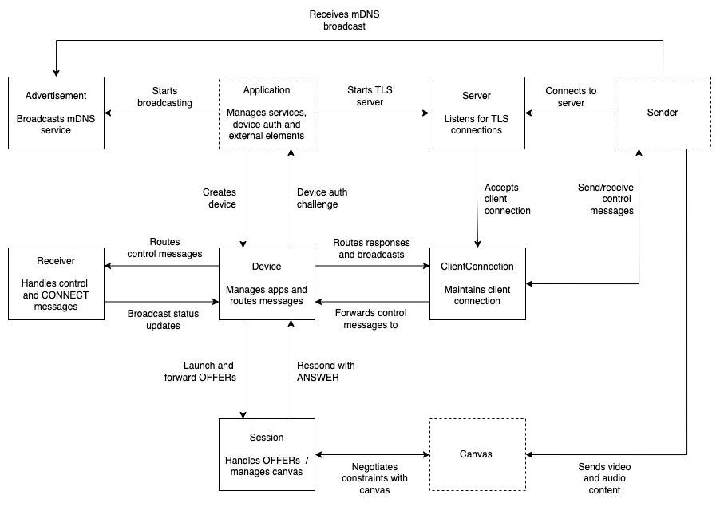

# GoCast

This project is intended to offer a complete implementation of the [Google Cast](https://en.wikipedia.org/wiki/Google_Cast) protocol, written in Go, with custom Sender and Receiver apps using [FFmpeg](https://ffmpeg.org/) as a frontend.

## Design

The following architecture diagram summarises the overall design of GoCast, and how it accommodates the requirements of the Google Cast protocol:

In terms of actual code, these concepts are implemented as Go structs.

## Usage

### Receiver App

The `receiver` app will start a Google Cast receiver, which can then be cast to from compatible senders.  

To run the receiver in your local dev environment:

    go run cmd/receiver/*.go --cert-manifest=<path>

Or to build an executable in `./bin/receiver`:

    go build -o ./bin/receiver ./cmd/receiver

The `receiver` app can also be run in relay mode, where it will handle device authentication, but otherwise forward all messages and data to another host.

### Sender App

To run the sender in your local dev environment:

    go run cmd/sender/*.go

Or to build an executable in `./bin/sender`:

    go build -o ./bin/sender ./cmd/sender

### Discovery App

The `discovery` app allows you to locate Google Cast devices on your network, using mDNS.

To run the discovery app in your local dev environment:

    go run cmd/discovery/*.go

Or to build an executable in `./bin/discovery`:

    go build -o ./bin/discovery ./cmd/discovery

### Cert Manifest

Before running the Receiver app, you will need to create (or otherwise obtain) a valid _certificate manifest_ file. A cert manifest is a JSON document containing the certificate and private key to be used TLS connections, and additional information used for Chromecast device authentication.

An example manifest is included in [etc/cert-manifest.json](./etc/cert-manifest.json). Note: This file does not include the fields required for device authentication.

## Protobuf

The Chromecast protocol relies on message types defined in protobuf format. The cast_channel.proto file in internal/message has been borrowed from the Chromium source code. To regenerate the Go bindings, run the following command:   

    protoc --go_opt=paths=source_relative --go_out=. ./internal/channel/cast_channel.proto
